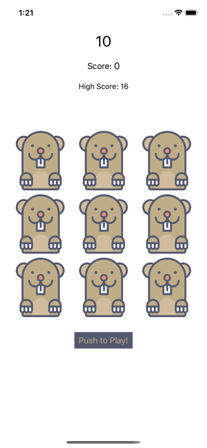

# Whac-a-Mole

### Overview

App version of classic arcade/carnival game. Uses Timer to countdown to game clock. Moles "appear" or "hide" by randomly. Tap gesture recognizer used to determine if mole is on screen when tapped and whether a miss (hammer shown) or a hit (boom shown). Game result is shown with an alert view. High score is persisted with user defaults. 

### Images

### Attributions

Mole icon made by <a href="https://www.flaticon.com/authors/darius-dan" title="Darius Dan">Darius Dan</a> from <a href="https://www.flaticon.com/" title="Flaticon"> www.flaticon.com</a>

Hammer icon made by <a href="https://www.flaticon.com/authors/good-ware" title="Good Ware">Good Ware</a> from <a href="https://www.flaticon.com/" title="Flaticon"> www.flaticon.com</a>

Boom icon made by <a href="https://www.flaticon.com/authors/freepik" title="Freepik">Freepik</a> from <a href="https://www.flaticon.com/" title="Flaticon"> www.flaticon.com</a>

